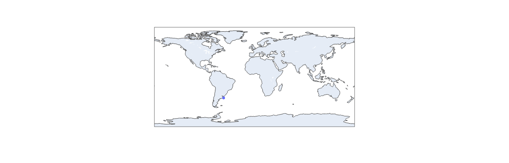

# ISS Tracking using Juypter Notebook

This Juypter Notebook can be used to track the Internation Space Station.

This is one of my first Notebooks to try using Pandas and Plotly outside of a bare-code environment. Will be learning and doing more hopefully with them soon for more in-depth data analysis.

## Tools Used

* Panadas
* Plotly
* Jupyter Notebook
* Python 3.11
* Open-Notify 'ISS Now' API

## Download and run
Download this Notebook and run it in Jupyter. You can get the location of the ISS's every 5 seconds due to API limitaions of feed update times. 

## The Notebook


```python
import pandas as pd
import plotly.express as px
```


```python
url = "http://api.open-notify.org/iss-now.json"
```


```python
df = pd.read_json(url)
```


```python
df
```


<div>
<style scoped>
    .dataframe tbody tr th:only-of-type {
        vertical-align: middle;
    }

    .dataframe tbody tr th {
        vertical-align: top;
    }

    .dataframe thead th {
        text-align: right;
    }
</style>
<table border="1" class="dataframe">
  <thead>
    <tr style="text-align: right;">
      <th></th>
      <th>iss_position</th>
      <th>message</th>
      <th>timestamp</th>
    </tr>
  </thead>
  <tbody>
    <tr>
      <th>latitude</th>
      <td>-37.8804</td>
      <td>success</td>
      <td>2024-03-08 13:23:34</td>
    </tr>
    <tr>
      <th>longitude</th>
      <td>-55.4827</td>
      <td>success</td>
      <td>2024-03-08 13:23:34</td>
    </tr>
  </tbody>
</table>
</div>


```python
df['latitude'] = df.loc['latitude', 'iss_position']
df['longitude'] = df.loc['longitude', 'iss_position']
df.reset_index(inplace = True)
```


```python
df
```


<div>
<style scoped>
    .dataframe tbody tr th:only-of-type {
        vertical-align: middle;
    }

    .dataframe tbody tr th {
        vertical-align: top;
    }

    .dataframe thead th {
        text-align: right;
    }
</style>
<table border="1" class="dataframe">
  <thead>
    <tr style="text-align: right;">
      <th></th>
      <th>index</th>
      <th>iss_position</th>
      <th>message</th>
      <th>timestamp</th>
      <th>latitude</th>
      <th>longitude</th>
    </tr>
  </thead>
  <tbody>
    <tr>
      <th>0</th>
      <td>latitude</td>
      <td>-37.8804</td>
      <td>success</td>
      <td>2024-03-08 13:23:34</td>
      <td>-37.8804</td>
      <td>-55.4827</td>
    </tr>
    <tr>
      <th>1</th>
      <td>longitude</td>
      <td>-55.4827</td>
      <td>success</td>
      <td>2024-03-08 13:23:34</td>
      <td>-37.8804</td>
      <td>-55.4827</td>
    </tr>
  </tbody>
</table>
</div>


```python
df = df.drop(['index','message'], axis=1)
```


```python
df
```


<div>
<style scoped>
    .dataframe tbody tr th:only-of-type {
        vertical-align: middle;
    }

    .dataframe tbody tr th {
        vertical-align: top;
    }

    .dataframe thead th {
        text-align: right;
    }
</style>
<table border="1" class="dataframe">
  <thead>
    <tr style="text-align: right;">
      <th></th>
      <th>iss_position</th>
      <th>timestamp</th>
      <th>latitude</th>
      <th>longitude</th>
    </tr>
  </thead>
  <tbody>
    <tr>
      <th>0</th>
      <td>-37.8804</td>
      <td>2024-03-08 13:23:34</td>
      <td>-37.8804</td>
      <td>-55.4827</td>
    </tr>
    <tr>
      <th>1</th>
      <td>-55.4827</td>
      <td>2024-03-08 13:23:34</td>
      <td>-37.8804</td>
      <td>-55.4827</td>
    </tr>
  </tbody>
</table>
</div>


```python
fig = px.scatter_geo(df, lat='latitude', lon='longitude')
```


```python
fig.show()
```

